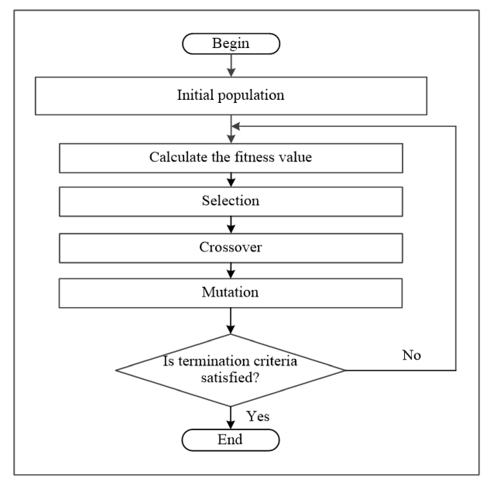
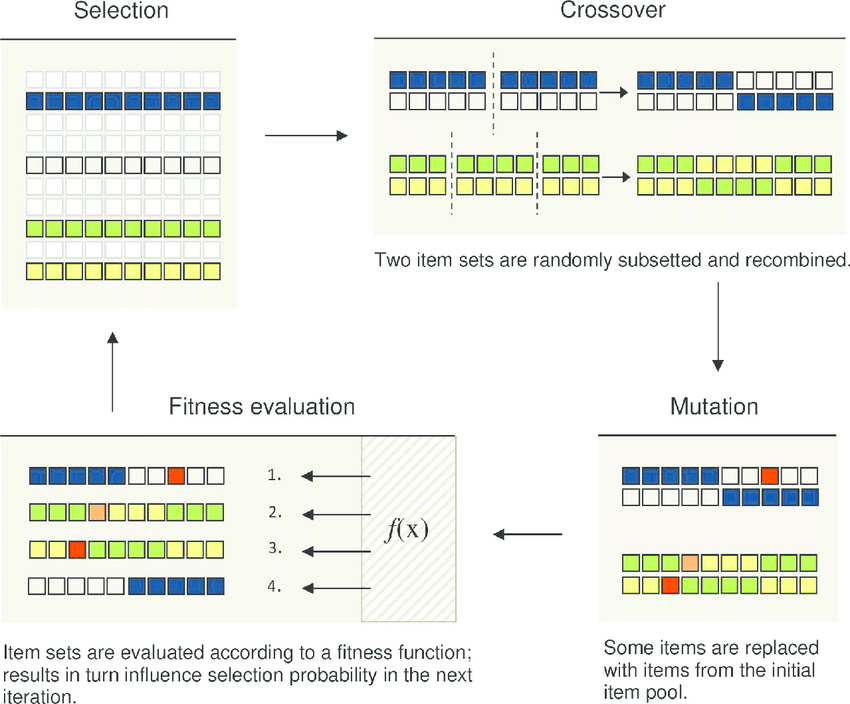

# Class scheduling using genetic algorithm
A genetic algorithm (GA) is a metaheuristic inspired by the process of natural selection that belongs to the larger class of evolutionary algorithms. 

GA works on a population consisting of some solutions where the population size (popsize) is the number of solutions. Each solution is called individual. Each individual solution has a chromosome. The chromosome is represented as a set of parameters (features) that defines the individual. Each chromosome has a set of genes. Also, each individual has a fitness value. To select the best individuals, a fitness function is used. The result of the fitness function is the fitness value representing the quality of the solution. The higher the fitness value the higher the quality the solution. Selection of the best individuals based on their quality is applied to generate what is called a mating pool where the higher quality individual has higher probability of being selected in the mating pool.

The individuals in the mating pool are called parents. Every two parents selected from the mating pool will generate two offspring (children). By just mating high-quality individuals, it is expected to get a better quality offspring than its parents. This will kill the bad individuals from generating more bad individuals. By keeping selecting and mating high-quality individuals, there will be higher chances to just keep good properties of the individuals and leave out bad ones. Finally, this will end up with the desired optimal or acceptable solution.

In this case GA was used to create schedule based on students class time preferences and on limit on the number of students in classes.

Genetic Algorithm scheme

Genetic Algorithm steps in detail
